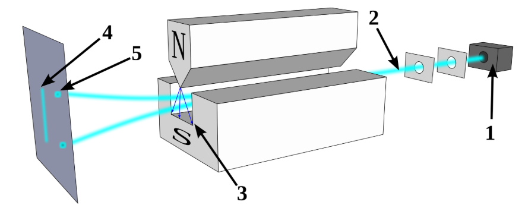

牛顿时代，人们就已经掌握了折射法让阳光产生色散的技术。1814年，夫琅禾费为了为了改进望远镜，进一步测量了阳光的成份，发现连续光谱的特定位置上，居然有上百条垂直黑线。一直到20世纪初，虽然人们已经掌握了光谱法测量原子特征，但这些离散谱线的成因一直是个迷题，它们究竟有什么规律？

为了解释这个现象，波尔引入了固定轨道的概念，即电子只能在一组指定的轨道上绕原子核转圈，就类似地球绕太阳公转，通过吸收和发射光子，电子可以在不同轨道间跳变。

但波尔这个模型比较粗糙，无法精细解释某些谱线的情况，比如上图中的「D线」就分裂成两根极其靠近的D1、D2，这称为谱线的精细结构。为了解释这些精细谱线，物理学家索莫非改进了波尔的方程式，他认为电子除运行在一组不连续的轨道上外，公转轨道面的倾斜度也不是任意的，只能是几个离散的数值。

众所周知，做圆周运动的物体有角动量，表达式为$L=rmv=r^2mw$，其中$r$为圆周半径。$L$的方向垂直于圆周面，和转动方向构成右手法则。可以想象成一个旋转的陀螺，角动量$L$可以理解为陀螺的轴，陀螺可以立着转，也可歪着转，但陀螺的轴总是与锥面垂直的。

索莫非提出的这个理论就是说，陀螺旋转时不能随便歪，只能歪成几个固定的角度，叫做「角动量量子化」。按照这个假设就就可以解释部分精细谱线的成因了。

理论是提出来了，但现实是不是这样子，还需要实验的检验，斯特恩-盖拉赫（**Stern–Gerlach**）实验正是因此而设计的。它的目标是检测电子轨道面的倾斜角是否只能取几个特定值，换句话说，就是把陀螺放到直角坐标系中看，陀螺轴$L$与坐标系$z$轴的夹角是否只能是几个固定角度。

1922年2月，某个寂静的深夜，盖拉赫（Gerlach）还在默默的盯着他的测量仪。就在今晚，人类将首次有意识的观测到量子现象，即电子旋转的角动量不能是任意的，只能取几个离散值。
### 实验原理

一个做环形运动的电子，等效于一个微观电流环路，具有轨道磁矩 $\mu$，通俗地说，就相当于在圆的中心放了一个小磁针，磁针N极的方向由电流方向决定，需要注意的是，电流方向与电子运动方向相反。如下图，从上方俯瞰，电子逆时转动，等效电流则为顺时针，那么等效磁针的N极垂直向下。

当电子轨道面由水平变为倾斜时，等效磁针的N极也跟着倾斜，但始终垂直轨道平面。为了方便，我们可以把做圆周运动的电子等价成一个小磁针，好比一个旋转的陀螺，磁针的N极就是陀螺轴的方向。

下图是斯特恩-盖拉赫实验装置，主要由发射腔、磁场区、观测屏几个部分组成。工作原理是： 
1. 银原子在高温腔$1$中被气化，并水平发射出来
2. 原子通过狭缝$2$，形成匀速直线的原子流，到达磁场区$3$
3. 经过磁场的作用后，最终打到观测屏$4$上

装置的核心部件是磁场区，运动中的原子等价于一个个磁针，由于磁针在磁场中受力，运动路线会向上或向下弯曲。但从发射腔出来的原子，姿态是随机的，N极可能竖直向上，也可能歪着、躺着...。实验装置的磁场中，N极朝上的小磁针受向上的拉力最大，假设为$F$，N极朝下的小磁针受向下拉力最大，设为$-F$，正负号代表受力方向，其余朝向的小磁针，比如斜着的、躺着的，受到的力在$-F$和$F$之间。

图中这组原子受到向上的拉力，$F$:

而这一组原子受到向上的拉力，介于 $(-F, F)$：

每个原子因受力不同，在垂直方向的运动距离也不同，但假设原子的姿态是均匀分布的，则观测屏垂直方向上的每个点，都会有原子落上去，即原子在观测屏上会形成一条竖直的线。直线的顶端和底端，分别是N极垂直朝上和朝下的原子。

但根据索莫非的新理论，电子公转面的倾角只能是几个离散值，则即原子落到屏幕上，不是一条垂直的线，而是几个聚集的点（或几条水平的直线）。究竟哪个理论是正确的呢，就要由本实验一槌定音了！

不负众望，实验结果让盖拉赫兴奋不已，因为在施加磁场后，本来聚集在接收屏中心的水平线，分裂成了上下两条分离的水平线，没有原子再落到中间！至此，我们可以跟经典世界说拜拜了。

<iframe width="640" height="360"  src="https://commons.wikimedia.org/wiki/File:Quantum_spin_and_the_Stern-Gerlach_experiment.ogv?embedplayer=true" />

但我们准备好迎接新世界了么，并没有！稍微分析下就会发现，本来磁针是任意方向的，但最终只落到了两条水平线上，说明不管他们原始倾角如何，在垂直方向都受到了完全相同的力，换句话说，连调整姿势的时间都没有，这是经典理论无法解释的！

### 连续观测
为了观察原子的倾角，我们安装了收屏上，并施加了外置的磁场，用于推测微观粒子的状态，这个动作在量子力学中叫做测量、或观测。

我们再往前多走一步，把多个斯特恩-盖拉赫装置级联起来，看看能发生什么。为方便讨论，设置一个如下的$o-xyz$坐标系，$x,y,z$轴分别代表前后、左右、上下方向。按照坐标系的设置，原子是沿y轴发射出来的，运动方向垂直于$ozx$面；磁场是沿$z$轴方向施加的。 

下列的实验中，每个标注S-G的方框，都是一个斯特恩-盖拉赫装置，黑色方块用于阻挡特定原子进入下一级。沿z轴施加磁场的时候，原子会分裂成两条水平线，落在屏幕上下两侧，分别用z+、z-来表示。
#### 1. 实验一
两个相同的装置级联起来，且都沿z轴施加磁场。第一级的输出端，只允许$z+$方向的原子进入下一级装置，如下图所示：

实验结果和预期一样，经过第二个装置后，确实只检测到了$z+$方向的原子，$z-$方向的原子被过滤掉了。

### 2. 实验二

现在把两个不同的装置级联起来，先施加$z$轴方向的磁场，让z+方向的原子进入第二级装置，第二级装置沿$x$轴施加磁场，如下图所示：

实验发现，原子束分别打在了x轴的两侧，说明沿z轴方向挑选出来的原子，并没有影响它们在x轴方向的行为。可以理解为这些筛选出的小磁针，同时指向z轴和x轴的正向，即指向在$ozx$坐标系的第一象限。

### 3. 实验三

如果实验二还勉强可以解释，那么这第三个实验就完全超出理解了。在实验二的基础上，选出x+方向的原子束，让它们进入第三个装置，它和第一个装置相同，施加了z轴方向的磁场，如下图：

神奇的事情发生了，通过第三个装置后，居然$z-$方向的原子又回来了，而这些原子在第一个装置中刚被过滤掉！可见，实验装置不仅仅是筛选特性性质的原子，它还在操作原子、并改变它们的状态。

梳理下这些实验现象，我们发现：
1. 原本任意方向的小磁针，在通过磁场的时候，「瞬时」改变了朝向
2. 改变后的状态，只能与磁场方向相同或相反
3. 实验装置不仅是一个筛选器，它还改变了小磁针的状态

要解释这个现象，还要等到1925年海森堡和薛定谔提出新的方程。用现代的术语来重新表述下这些规律：
* 规律一：测量只能得到两个离散值。无论小磁针的指向如何，观测的时候，只能看到z+、z-两个结果
* 规律二：测量前，小磁针是z+和z-的叠加态，测量时状态「瞬时」改变
* 规律三：测量会改变粒子状态
	* 连续两次相同的测量，第二次测量的结果是100%确定的，退化成了经典测量
	* 连续两次不同的测量，会改小磁针状态。比如，沿x方向测量，会改变前序沿z方向测量的结果

在量子计算机中，这个「小磁针」就是信息的载体，相当于一个二进制比特，它奇特的性质构成了量子计算的基本原理。现实中，「小磁针」有多种实现方式，比如超导电流、离子阱、光子、NMR等，虽然底层物理原理各异，但它们表现出来的量子特性都是一样的。

为了方便，无论是什么物理架构的量子计算机，都可把量子比特想象为一个小磁针：无论它的朝向如何歪歪扭扭的，在测量的时候，它们就瞬间变成上、下两种个状态之一。

接下来我们会探讨下如何通过数学原理来描述这些特性和规律，这是深入研究量子算法的基础。

