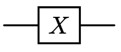
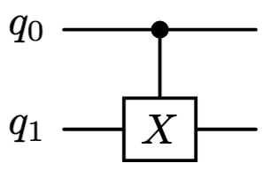
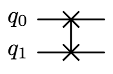
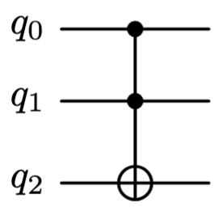

上一章，通过布洛赫球探讨了单比特量子门的操作，但要通过量子态实现信息处理，仅通过单量子比特是远远不够的，为此必须通过多量子比特间的互操作实现，本章主要介绍多量子比特是如何协同实现信息处理的。

我们知道，单量子比特的量子态可以通过二维空间的向量描述，那么多量子比特系统的量子态该如何描述呢，为了解决这个问题，我们先从空间的扩展开始，掌握了对应的数据工具后，再探讨多量子系统的处理就容易了。
### 空间扩展与张量积
单量子比特的状态$\ket \psi$ 可以在基$\ket 0, \ket 1$ 上展开，它是二维空间中的一个向量。为了描述 $n$ 个量子比特构成的量子态，就需要引入一种新的运算-张量积，也称Kronecker积，用符号$\otimes$ 表示。

张量积是一种将多个低维空间连接成高维空间的方法，该方法是理解量子力学中多体系统的关键。先从一个简单例子开始，假设有两个量子比特$a,b$ ，各自的量子态可以表示为
$$
\begin{cases}
\ket a \, &= \,a_0\ket 0 + a_1\ket 1 \\
\ket b \, &= \,b_0 \ket 0 + b_1 \ket 1
\end{cases}
$$
单独看，每个比特都是在$\ket 0, \ket 1$ 上展开的二维向量。但作为一个整体看的话，就需要把它们的量子态合并起来。 
#### 直积的分配律
把量子比特$a,b$ 作为整体来看时，系统就有“$00,01,10,00$” 4个本征态，整体状态则应该是这4个本征态的叠加，用张量积表示就是：
$$
\begin{align*}
\ket \psi &= \ket a \otimes \ket b \\
&= (a_0\ket 0 + a_1\ket 1) \otimes (b_0\ket 0 + b_1\ket 1) \\
& = a_0b_0\ket{00} + a_0b_1\ket{01} + a_1b_0\ket{10} + a_1b_1\ket{11} \\
\end{align*} 
$$
 $\text{其中\,}\ket {00} \equiv \ket 0 \otimes \ket 0$ ，通过这个例子发现，张量积$\otimes$ 的运算拓展了空间的维度，并规则遵守分配律。
#### 张量积的矩阵表示
刚才通过狄拉克符号展示了张量积的运算规则，当态矢用矩阵表示时，运算规则同样直观：

$$
\ket 0 \otimes \ket 0 \equiv \ket {00} 
= \begin{bmatrix}1\\0\end{bmatrix} \otimes \begin{bmatrix}1\\0\end{bmatrix}
= \begin{bmatrix}1 \cdot \begin{bmatrix}1\\0\end{bmatrix} \\0 \cdot \begin{bmatrix}1\\0\end{bmatrix}\end{bmatrix}
= \begin{bmatrix}1\\0\\0\\0\end{bmatrix}
$$
$$
\ket 0 \otimes \ket 1 \equiv \ket {01} 
= \begin{bmatrix}1\\0\end{bmatrix} \otimes \begin{bmatrix}0\\1\end{bmatrix}
= \begin{bmatrix}1 \cdot \begin{bmatrix}0\\1\end{bmatrix} \\0 \cdot \begin{bmatrix}0\\1\end{bmatrix}\end{bmatrix}
= \begin{bmatrix}0\\1\\0\\0\end{bmatrix}
$$
$$
\ket 1 \otimes \ket 0 \equiv \ket {10} 
= \begin{bmatrix}0\\1\end{bmatrix} \otimes \begin{bmatrix}1\\0\end{bmatrix}
= \begin{bmatrix}0 \cdot \begin{bmatrix}1\\0\end{bmatrix} \\1 \cdot \begin{bmatrix}1\\0\end{bmatrix}\end{bmatrix}
= \begin{bmatrix}0\\0\\1\\0\end{bmatrix}
$$
$$
\ket 1 \otimes \ket 1 \equiv \ket {11} 
= \begin{bmatrix}0\\1\end{bmatrix} \otimes \begin{bmatrix}0\\1\end{bmatrix}
= \begin{bmatrix}0 \cdot \begin{bmatrix}0\\1\end{bmatrix} \\1 \cdot \begin{bmatrix}0\\1\end{bmatrix}\end{bmatrix}
= \begin{bmatrix}0\\0\\0\\1\end{bmatrix}
$$
两个2维空间通过张量积拓展成了4维空间，$\ket {00},\ket {01},\ket {10},\ket {11}$ 是这个4维空间的正交基，空间中任何矢量都可以在这组基上展开。
#### 算符的张量积

根据刚才探讨，在双比特系统中，态矢由$2\times 1$ 向量变成了$4\times 1$ 向量，为了满足矩阵的运算法则，双比特系统中幺正算符$U$也必须扩展为$4\times 4$矩阵。

我们已经知道了态矢 $\ket a \otimes \ket b$ 的计算规则，再通过一个例子，看下矩阵$U_1\otimes U_2$ 的计算规则

$$
\begin{align*}
& \text{设\,} U_1 = \sigma_x \equiv \begin{bmatrix}0 & 1 \\ 1& 0 \end{bmatrix} \\
& \text{设\,} U_2 = \sigma_y \equiv \begin{bmatrix}0 & -i \\ i & 0 \end{bmatrix} \\
& U_1 \otimes U_2 = \begin{bmatrix}0 & 1 \\ 1& 0 \end{bmatrix} 
	\otimes \begin{bmatrix}0 & -i \\ i & 0 \end{bmatrix}
	= \begin{bmatrix}
		0 \cdot {\begin{bmatrix}0 & -i \\ i & 0 \end{bmatrix}}  & 
		1 \cdot {\begin{bmatrix}0 & -i \\ i & 0 \end{bmatrix}} \\ 
		1 \cdot {\begin{bmatrix}0 & -i \\ i & 0 \end{bmatrix}} & 
		0\cdot {\begin{bmatrix}0 & -i \\ i & 0 \end{bmatrix}}
	 \end{bmatrix} \\
 &=\begin{bmatrix}0 & 0 & 0 &-i \\ 0&0&i & 0 \\ 0&-i&0&0\\i&0&0&0 \end{bmatrix}
\end{align*}
$$

通过复杂但不难的计算，可以验证
$$
(U_1 \ket a) \otimes (U_2 \ket b) = (U_1\otimes U_2)(\ket a \otimes \ket b)
$$
两个子系统变换后的张量积，等于算符和态矢分别做张量积后，再整体做变换。这个公式很重要，在量子算法设计和量子线路化简中经常使用。

可见，张量积可以实现单量子比特空间向多量子比特空间的扩展。单量子比特态矢是$2$维的，双量子比特态矢是$4$维的，更一般的，$n$ 量子比特态矢则是$2^n$ 维空间中的一个单位向量，即$n$ 量子比特系统中，任一态矢可以在$2^n$ 个本征态上展开。

### 量子门
非门和与非门是经典数字电路的基础，所有数字逻辑都可以基于它们来构建。简要回顾一下，它们的逻辑符号、真值表如下

<table  >
<tr style="">
<td style="width: 10%; text-align: center; vertical-align: middle; font-weight: bold;">逻辑门</td>
<td style="width: 40%; text-align: center; vertical-align: middle;  font-weight: bold;">逻辑符号</td>
<td style="width: 40%; text-align: center; vertical-align: middle; font-weight: bold;">真值表 (Truth Table)</td>
</tr>
<tr >  
	<td style="text-align: center; vertical-align: middle; padding: 0px;">经典「非门」</td>
	<td style="text-align: center; vertical-align: middle; padding: 0px;">
	</td>
	<td style="text-align: center; vertical-align: middle; padding: 0px;">
	
	</td>
</tr>
<tr style="border-bottom: solid #e0e0e0;">  
<td style="text-align: center; vertical-align: middle; padding: 0px;">经典「与非门」</td>
	<td style="text-align: center; vertical-align: middle; padding: 0px;">
	 
	</td>
	<td style="text-align: center; vertical-align: middle; padding: 0px;">
	
	</td>
</tr>
</table>

#### 非门
经典「非门」的作用是对输入信号，实现0、1互换。在量子算符中，X门的行为如下
$$
\begin{cases}
X\,\ket 0 &= \,\ket 1 \\
X\,\ket 1 & =\, \ket 0 \\
X\,(\alpha\ket 0 + \beta \ket 1) &= \beta \ket 0 + \alpha \ket 1
\end{cases}
$$
即X门的作用也是把$\ket 0, \ket 1$ 互换，可以认为量子X门作用与经典「非门」类似。不同的是，X门修改的不是输入电平值，而是量子态中$\ket 0, \ket 1$ 的概率。

在量子线路中，X门一般用如下逻辑符号表示

 

#### 与非门
既然X门与经典非门对应，那么与经典「与非门」对应的算符是什么呢？为了回答这个问题，需要先看看幺正算符的特性：
$$
\begin{align*}
& \ket {\psi_2} = U\ket {\psi_1} \\
\Rightarrow \, &U^\dagger \ket {\psi_2} = U^\dagger U\ket {\psi_1} = \ket {\psi_1} \\

\end{align*}
$$
上式利用了 $U^\dagger U = UU^\dagger = I$ 。可见态矢$\ket \psi$ 变换后，还可以通过另一个算符完全还原回来，即变换前后没有信息损耗，这在量子计算中称为可逆计算，是量子计算机的重要特性。总结一下，量子门作为幺正算符，需要满足如下两个条件：
1. 输入和输出的比特位数是相同的
2. 根据输出，可以复原输入，即没有信息损失
这个准则可以用来判断算法能否通过量子计算实现。

再看下经典与非门，$Q = \overline{A\, and\, B}$ ，当Q取「1」的时候，完全无法确定输入A、B的值是什么，也就是说经典与非门是有信息损失的。与非门是两比特输入、一比特输出，这在量子计算中是无法对等实现的。

但探讨下量子计算中，有无折中方案也是很有价值的，考察如下线路

上图表示一个受控的X门，当$q_0$ 为$\ket 0$ 的时候，$q_1$ 的输出不变，当$q_0$ 为$\ket 1$ 时，$q_1$ 作用于X门，即取反，这个线路被称为$CNOT$门，或「受控非门」。通过真值表来看下$CNOT$门的逻辑：

| 输入$q_0$ | 输入$q_1$ | 输出$q_0$ | 输出$q_1$ |
| ------- | ------- | ------- | ------- |
| 0       | 0       | 0       | 0       |
| 0       | 1       | 0       | 1       |
| 1       | 0       | 1       | 1       |
| 1       | 1       | 1       | 0       |

观察容易发现，只要知道$q_1,q_0$ 的输出，完全可以反推出对应输入，说明$CNOT$门可以通过一个幺正算符实现。另外 ，在CNOT门的作用如下
$$U \ket{q_0, \,q_1} = \ket {q_0,\, q_0 \oplus q_1}$$
即$q_0$在变换前后维持不变，而$q1$ 的输出则是两输入的异或（ $xor$） 运算，因此$CNOT$门对应于经典「异或门」，不同的是经典「异或门」只有一个输出，而$CNOT$门有两个输出。

$CNOT$门可以通过幺正矩阵表示为
$$ 
CNOT = \begin{bmatrix}1 & 0 & 0 & 0 \\0&1&0&0 \\ 0&0&0&1 \\ 0&0&1&0 \end{bmatrix}
$$
可以验证 $CNOT\, \times CNOT^\dagger = CNOT^\dagger\,\times CNOT = I$，满足幺正算符的定义。令$CNOT$算符作用在态矢$\ket {00}$ 上
$$
CNOT\,\ket {00} = \begin{bmatrix}1 & 0 & 0 & 0 \\0&1&0&0 \\ 0&0&0&1 \\ 0&0&1&0 \end{bmatrix}
\begin{bmatrix}1\\0\\0\\0\end{bmatrix}
= \begin{bmatrix}1\\0\\0\\0\end{bmatrix}
= \ket {00}
$$
结果与真值表的第一行是相同的。通过简单计算可验证，算符也满足真值表中其它3行的要求。

同时也能看到，双量子比特系统中，态矢和算符已扩展到四维空间。如果系统有$n$ 个量子比特，算符就是$2^n \times 2^n$ 矩阵，因此矩阵的维度呈指数级增长，这也正是用经典计算机上模拟量子系统的时，很快就会遇到算力瓶颈的原因。

虽然刚才实现了一个「异或门」，但在量子计算机上，「与非门」是无法通过双比特量子门是无法实现的，必须添加额外辅助比特，才能构造出幺正变换，即通过三比特量子门可以实现与非门。
#### 交换门

互换门，又称SWAP门，为双量子比特门，可以让两个输入量子比特互换量子态。SWAP门的算符表示为
$$
SWAP = \begin{bmatrix} 1&0&0&0 \\ 0&0&1&0 \\ 0&1&0&0 \\ 0&0&0&1\end{bmatrix}
$$
可以验证 $SWAP\times SWAP^\dagger = SWAP^\dagger\times SWAP = I$ ，因此SWAP算符为幺正算符。SWAP门的功能使用狄拉克符号表示为
$$
\ket {a,b} \xrightarrow{SWAP} \ket {b,a} 
$$
SWAP门一般用如下逻辑符号表示

SWAP门应用非常广泛，是量子计算机工作的基础，它可以通过3个CNOT门实现，因此实现成本比较高，线路图如下

### 三量子门

正如上面提到的，经典与非门的输入和输出不是可逆的，无法构造幺正算符，因此无法在量子计算机上直接实现。但可以通过添加辅助比特，保留丢失的信息，从而构造一个类比与非门的量子门。

如下图的三比特量子门，被称为Toffoli门（CCX门或CCNOT门）。当$b_0,b_1$ 都为1的时候，X门才会作用在$b_2$ 上，实现$b2$ 的状态反转，

用狄拉克符号表示CCNOT门的计算逻辑就是
$$
\ket {q_0, q_1, q_2} \rightarrow \ket {q_0, \, q_1,\, (q_0 \cdot q_1)\otimes q_2}
$$
CCNOT门的真值表如下

| $\mathbf{q_0}$ | $\mathbf{q_1}$ | $\mathbf{q_2}$ | $\mathbf{q_0 \cdot q_1}$ | $\mathbf{(q_0 \cdot q_1)\otimes q_2}$ |
| -------------- | -------------- | -------------- | ------------------------ | ------------------------------------- |
| 0              | 0              | 1              | 0                        | 1                                     |
| 1              | 0              | 1              | 0                        | 1                                     |
| 0              | 1              | 1              | 0                        | 1                                     |
| 1              | 1              | 1              | 1                        | 0                                     |
| 0              | 0              | 0              | 0                        | 0                                     |
| 1              | 0              | 0              | 0                        | 0                                     |
| 0              | 1              | 0              | 0                        | 0                                     |
| 1              | 1              | 0              | 1                        | 1                                     |
观察可以发现，当$q_2 = 1$时，$q_2$的输出就是 $\overline{q_0 \,and\, q_1}$ ；当$q_2 = 0$时，变换后$q_2$的输出就是 $(q_0 \,and\, q_1)$ ，即通过设置$q_2$ 的输出状态，CCNOT可分别实现与非门和与门。 

分析下CCNOT门的幺正矩阵是什么：
*  当$q_0$为$\ket 1$的时候，$q_1,q_2$ 构成了一个双比特的CNOT门；
*  当$q_0$为$\ket 0$的时候，$q_1,q_2$ 维持原状态，相当于应用了一个单位门$I$

使用张量积的方式构造这个三比特量子门的幺正矩阵：
$$
\begin{align*}
&CCNOT_{q_0,q_1,q_2} &&= \ket 0 \bra 0\otimes I \otimes I = \ket 1 \bra 1 \otimes CNOT_{q_1, q_2} \\
	& && =\begin{bmatrix}1 & 0 \\0 &0  \end{bmatrix} \otimes I \otimes I 
	+ \begin{bmatrix} 0& 0 \\0 &1  \end{bmatrix} \otimes CNOT_{q_1, q_2} \\
	& &&= \begin{bmatrix}1 \cdot I\otimes I & 0 \cdot I\otimes I \\ 0\cdot I\otimes I & 0  \cdot I\otimes I \end{bmatrix} 
	+ \begin{bmatrix} 0 \cdot CNOT_{q_1, q_2} & 0 \cdot CNOT_{q_1, q_2} \\0 \cdot CNOT_{q_1, q_2} &1 \cdot CNOT_{q_1, q_2} \end{bmatrix} \\
	& &&= \begin{bmatrix}I \otimes I & \mathbf 0 \\ \mathbf 0 & CNOT_{q_1, q_2} \end{bmatrix} \\
	
& 由 &&\quad \begin{cases}
 I \otimes I = \begin{bmatrix}1&0&0&0 \\ 0&1&0&0 \\ 0&0&1&0 \\ 0&0&0&1 \end{bmatrix} \\
 CNOT = \begin{bmatrix}1 & 0 & 0 & 0 \\0&1&0&0 \\ 0&0&0&1 \\ 0&0&1&0 \end{bmatrix}
 \end{cases} \\
 
 &得 \quad  CCNOT_{q_0,q_1,q_2} &&= \begin{bmatrix}
		1 & 0 & 0 & 0 & 0 & 0 & 0 & 0 \\
		0 & 1 & 0 & 0 & 0 & 0 & 0 & 0 \\
		0 & 0 & 1 & 0 & 0 & 0 & 0 & 0 \\
		0 & 0 & 0 & 1 & 0 & 0 & 0 & 0 \\
		0 & 0 & 0 & 0 & 1 & 0 & 0 & 0 \\
		0 & 0 & 0 & 0 & 0 & 1 & 0 & 0 \\
		0 & 0 & 0 & 0 & 0 & 0 & 0 & 1 \\
		0 & 0 & 0 & 0 & 0 & 0 & 1 & 0 
	\end{bmatrix}
\end{align*}
$$

为了展示张量积的计算规则，特意把步骤罗列了一下。再次验证了幺正矩阵的维度，随量子比特指数增长，这对经典模拟提出了很大挑战，但这也正是量子计算优势的来源！想象一下，有$n$ 个量子比特，一次幺正变换，就可以实现$2^n$ 维空间内向量的运算，何其壮观。例如，若有30个量子比特，一次幺正变换，相当于瞬时完成 $2^{30} \times 2^{30}$ 维矩阵乘法。

注意：和经典计算机一样，$q_0,q_1,q_2$ 的排列方式也有大小端模式（高位在左、还是在右），以及哪个比特做控制位，不同的排列方式，对比特系统的幺正矩阵就有不同的表达形式，这是预期之内的，在实际计算中，前后保持一致即可。
