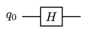

19世纪初，傅里叶随拿破仑远征埃及，负责监督武器生产，特别是火炮的铸造。为了解决大炮炸膛问题，傅里叶建立了炮管上热传导的偏微分方程。为了解这个方程，傅里叶提出了一个相当前瞻性的假设：有限区间内的任意函数，都可以在正弦或余弦上展开。这个设想在当时引起了很大的轰动和质疑，并成为推动数学近200多年发展的大动脉之一，这就是今天广为熟知的傅里叶变换。

用现代的语言说，就是任意周期函数$f(t)$ 都可以用如下形式表示：
 $$
 \begin{align*}
 f(t) &= \frac{a_0}{2} + \sum_{n=1}^\infty a_n\cos n\omega t + b_n\sin n\omega t \\
 &= \frac{a_0}{2} + a_1\cos\omega t + b_1\sin\omega t + a_2\cos2\omega t + b_2\sin 2\omega t + \cdots + a_n\cos n\omega t + b_n\sin n\omega t + \cdots 
 \end{align*}
 $$
式中的$a_n,b_n$ 被称为傅里叶级数。从向量投影分解的角度看，上式表示$f(t)$ 在正弦和余弦函数构成的基底上的展开。后来人们又改进了它的表示形式，借助欧拉公式，以复指数 $e^{i n\omega t}$ 作为基底，傅里叶级数可以用更简洁的方式表示：
$$
\begin{align*}
&f(t) = \sum_{n=-\infty}^{+\infty} c_ne^{in\omega t} \\
&\text{其中}\quad e^{i\theta} = \cos\theta + i\sin\theta
\end{align*}
$$
我们的目标不是深入分析傅里叶变换，因此这里避繁就简，通过一个简单例子，回顾一下它的形式和作用。
#### 一个平凡的例子
这是一个最简单、最平凡、但有代表性的例子，设$f(t) = cos2\pi t$ ，选择 $T=1$ 作为函数$f(t)$的周期，则函数可在余弦函数上做如下展开：
$$ 
\begin{align*}
&f(t) = 1 \cdot \cos 2 \pi t = 1 \cdot cos \omega t \\
& \omega = \frac{2\pi}{T} = \frac{2\pi}{1} = 2\pi 
\end{align*}
$$
观察可得，$f(t)$ 的展开式中，各谐波（正余弦函数）的系数
$$
\begin{align*}
&a_n = \begin{cases}
	\quad 1, &n=1 \\
	\quad 0, &others 
\end{cases} \\
&b_n =  0 
\end{align*}
$$
系数$a_n$ 就是函数$f(t)$ 的傅里叶级数，每个系数代表一个特定频率的谐波，比如，$a_1 \leftrightarrow sin \omega t$ 表示频率为$\omega$ 的谐波、$a_2 \leftrightarrow sin 2\omega t$ 表示频率为$2\omega$ 的谐波，依次类推。

同时，$f(t)$ 也可以在单位复向量$e^{in\omega t}$ 上展开
$$
f(t) = \frac{1}{2} \cdot e^{-i2\pi t} + \frac{1}{2} \cdot e^{i2\pi t} 
$$
即在复数基上，$f(t)$ 的傅里叶级数为
$$
c_n = \begin{cases}
\quad \frac{1}{2}, &n=-1 \\
\quad \frac{1}{2}, &n=1 \\
\quad 0, &others 
\end{cases}
$$
由$a_n = c_n + c_{-n}$ ，通过复数基和三角级数得到的傅里叶级数是一样的，两种方法是等价的，但在复数基上只需要计算一个系数就可以。

通过傅里叶级数，一个时域的周期函数可以表示为一组离散谐波的组合。  当以正余弦函数为基底时，傅里叶级数的计算方式如下
$$
\begin{align*}
&a_n = \frac{2}{T}\int_{-\frac{T}{2}}^{\frac{T}{2}} f(t)\cos n\omega t\,dt \\
&b_n = \frac{2}{T}\int_{-\frac{T}{2}}^{\frac{T}{2}} f(t)\sin n\omega t\,dt \\
& w = \frac{2\pi}{T}
\end{align*}
$$
以复指数函数$e^{inwt}$ 为基底时，傅里叶级数的计算方式是
$$
c_n = \frac{1}{T}\int_{-\frac{T}{2}}^{\frac{T}{2}} f(t) \,e^{ -in\omega t}\,dt, \quad \text{其中} w = \frac{2\pi}{T}
$$

把变换前后的信号放到一起，如下图所示：

上半部分为时域信号，是三个不同频率的波，横轴为时间$t$；下半部分为频谱图，横轴代表频率$w$，脉冲$a_n$ 就是傅里叶级数，对应一个谐波 $cos(nwt)$ 。 正弦波的频率增高(周期减小），频谱图中的脉冲会向右移动，即向$w$ 增大的方向。
#### 方波的傅里叶展开
对于正弦波这样的简单信号，频谱就是一个脉冲。如果时域信号比较复杂，频域一般是一组脉冲的组合。对于一个方波信号$f(t)$，周期为$T = 2\pi$ ：

将方波$f(t)$ 以周期$T$ 在三角函数上展开，各项系数如下：
$$
\begin{align*}
& a_n = 0 \quad n = 1,2,\cdots \\
& \\
&\begin{aligned}
	b_n &= \frac{2}{\pi} \int_{0}^{\pi} 1\cdot \sin nx \, dx = -\frac{2}{n\pi} \cos nx \bigg|_{0}^{\pi} \\
	&= \frac{2[1 - (-1)^n]}{n\pi} \\
	&= \begin{cases} 
	0, & n = 2k \\
	\dfrac{4}{(2k-1)\pi}, & n = 2k-1 
	\end{cases} \quad k = 1, 2, \dots
\end{aligned}
\end{align*}
$$
由于$f(t)$ 为奇函数，傅里叶级数$a_n = 0$ ，展开式中就只剩下了正弦项
$$
f(t) =  \frac{\pi}{4}(\sin x + \frac{1}{3}\sin 3x + \frac{1}{5}\sin 5x + \cdots) 
$$
傅里叶级数$b_n$ 是一组离散值，它在频域中有如下的形式：

这个例子体现了傅里叶变换的作用，即把时间维度上的信号，表示为一组频率，而这组频率对应的是一组正弦波，把这组正弦波加起来，就是原信号。

还需要验证下$f(t)$ 展成的三角级数与原函数的关系：分别取展开式中的前1项、前2项和、前3项和、前4项和，得到的函数图像如下所示

可见当取前4项和的时候，已经比较接近方波。取更多项和的话，主要就是修正局部信息了。这个例子，也验证了一下傅里叶的断言，周期函数可以表示为一组三角谐波的组合。

既然时域信号和频域信号可以互相转换，换个角度看，时域和频率可能是观察一个客体的两个角度。对于这个方波信号而言，图中从前向后看，以坐标轴为时间，它的振幅就是一个方波；图中从右向左看，以坐标轴为频率，它就是一组离散的频谱。这两个视角都可以完整的描述这个信号，因此傅里叶变换只是让我们从不同角度去观察这个信号而已。

### 离散傅里叶变换

为了在计算机中处理信号，需要把时域中的连续信号转变为数字信号，这个过程叫做采样，即对连续信号以恰当的时间间隔，记录下当时的幅度，就形成了一组离散的信号样点。只要采样的频率得当，这组离散信号就可以还原、代替原始信号，这个最低采样的频率叫奈奎斯特频率，定性的理解就是采样不能太慢，否则容易丢失信息。

刚讨论了时域中连续信号的傅里叶变换，对于一组采样后的离散数据点，同样也可以做傅里叶变换，通常叫做离散傅立叶变换，其物理含义与对连续信号的变换是可以类比的，就不赘述了。

假设有一组数据，代表对时域信号的采样，用向量表示为$X = [x_0, x_1, \dots, x_{N-1}]^\mathrm{T}$ ，经过如下变化后，输出是 $Y =[y_0, y_1, \dots, y_{N-1}]^\mathrm{T}$ 
$$
y_k = \frac{1}{\sqrt{N}} \sum_{j=0}^{N-1} x_j e^{i \frac{2\pi}{N} jk}
$$
这就是离散傅里叶变换，它的计算方式从积分变成了求和，并以复指数为基。在线性空间上用矩阵和向量表示的话，则离散傅里叶变换满足如下方程：
$$
\begin{bmatrix}y_0\\ y_1\\ \vdots\\ y_{N-1}\end{bmatrix} = \frac{1}{\sqrt{N}} \begin{bmatrix} 1 & 1 & \dots & 1 \\ 1 & \omega & \dots & \omega^{N-1} \\ \vdots & \vdots & \ddots & \vdots \\ 1 & \omega^{N-1} & \dots & \omega^{(N-1)^2} \end{bmatrix} 
	\begin{bmatrix} x_0\\ x_1\\ \vdots \\ x_{N-1})\end{bmatrix}
$$
其中 $\omega = e^{i \frac{2\pi}{N}}$ 。

右侧的$N\times N$ 矩阵，就是离散傅里叶变换（DFT）的矩阵形式，即
$$
U_{\text{DFT}} = \frac{1}{\sqrt{N}} \begin{bmatrix} 1 & 1 & 1 & 1 & \dots & 1 \\ 1 & \omega & \omega^2 & \omega^3 & \dots & \omega^{N-1} \\ 1 & \omega^2 & \omega^4 & \omega^6 & \dots & \omega^{2N-2} \\ \vdots & \vdots & \vdots & \vdots & \ddots & \vdots \\ 1 & \omega^{N-1} & \omega^{2N-2} & \omega^{3N-3} & \dots & \omega^{(N-1)^2} \end{bmatrix}
$$

当$N=8$ 时，即在3 qubit的量子系统中，DFT矩阵表示如下

$$
U_{DFT} = \frac{1}{\sqrt{8}} \begin{bmatrix} 
1  &1 & 1 &1 &1&1&1&1 \\ 
1 & \omega^1 & \omega^2 & \omega^3 & \omega^4 & \omega^5 & \omega^6 & \omega^7 \\
1 & \omega^2 & \omega^4 & \omega^6 & \omega^0 & \omega^2 & \omega^4 & \omega^6 \\ 
1 & \omega^3 & \omega^6 & \omega^1 & \omega^4 & \omega^7 & \omega^2 & \omega^5 \\
1 & \omega^4 & \omega^0 & \omega^4 & \omega^0 & \omega^4 & \omega^0 & \omega^4 \\ 
1 & \omega^5 & \omega^2 & \omega^7 & \omega^4 & \omega^1 & \omega^6 & \omega^3 \\ 
1 & \omega^6 & \omega^4 & \omega^2 & \omega^0 & \omega^6 & \omega^4 & \omega^2 \\ 
1 & \omega^7 & \omega^6 & \omega^5 & \omega^4 & \omega^3 & \omega^2 & \omega^1
\end{bmatrix}
$$
其中，$w=e^{i\frac{2\pi}{8}} = e^{i\frac{\pi}{4}}$ 。

假设此时有输入样本，$X=[0,0,1,0,0,0,0,0]$ ，它表示除$x_2=1$ 外，其他样点都为0的，这是一个脉冲信号，用$\delta(x - x_2)$ 表示。这组输入，经过傅里叶变换，输出为
$$
\begin{align*}
Y &= \frac{1}{\sqrt{8}} \begin{bmatrix} 
	1  &1 & 1 &1 &1&1&1&1 \\ 
	1 & \omega^1 & \omega^2 & \omega^3 & \omega^4 & \omega^5 & \omega^6 & \omega^7 \\
	1 & \omega^2 & \omega^4 & \omega^6 & \omega^0 & \omega^2 & \omega^4 & \omega^6 \\ 
	1 & \omega^3 & \omega^6 & \omega^1 & \omega^4 & \omega^7 & \omega^2 & \omega^5 \\
	1 & \omega^4 & \omega^0 & \omega^4 & \omega^0 & \omega^4 & \omega^0 & \omega^4 \\ 
	1 & \omega^5 & \omega^2 & \omega^7 & \omega^4 & \omega^1 & \omega^6 & \omega^3 \\ 
	1 & \omega^6 & \omega^4 & \omega^2 & \omega^0 & \omega^6 & \omega^4 & \omega^2 \\ 
	1 & \omega^7 & \omega^6 & \omega^5 & \omega^4 & \omega^3 & \omega^2 & \omega^1
\end{bmatrix}\begin{bmatrix}0\\0\\1\\0\\0\\0\\0\\0\end{bmatrix} 
= \frac{1}{\sqrt{8}}\begin{bmatrix} \omega^0 \\ \omega^2 \\ \omega^4 \\ \omega^6 \\ \omega^0 \\ \omega^2 \\ \omega^4 \\ \omega^6  \end{bmatrix}
= \frac{1}{\sqrt{8}}\begin{bmatrix} 1 \\ i \\ -1 \\ -i \\ 1 \\ i \\ -1 \\ -i  \end{bmatrix}
\end{align*}
$$
复平面上看，$1,i,-1,-i$ 分别对应单位圆与坐标轴的4个交点。

按照顺序观察这8个输出值，发现它表示单位向量在复平面上逆时针旋转了2圈。脉冲信号$\delta(x - x_k)$ ，变换到频域，系数代表的复向量，会在复平面上逆时针旋转$k$圈，这个直观的规律在设计量子算法时很实用。

再看下$N=2$的情况，即1 qubit的量子系统，可得DFT矩阵
$$
U_{DFT} = \frac{1}{\sqrt{2}} \begin{bmatrix} 
	\omega^0 & \omega^0  \\ 
	\omega^0 & \omega^1 
\end{bmatrix} = \frac{1}{\sqrt{2}} \begin{bmatrix} 
	1 & 1  \\ 
	1 & -1 
\end{bmatrix}
$$
似曾相识？这正量子计算中的H算符！可以说，H算符就是最简单的傅里叶变换，它只有一个量子比特。

实际上还可以验证，对于任意维度的DFT矩阵，有如下关系：
$$
U_{DFT}\,U_{DFT}^\dagger = U_{DFT}^\dagger\,U_{DFT} = I
$$
即离散傅里叶变换本身就是一个幺正算符，换句话说，在量子计算中，它是可以直接实现的！

### 量子傅里叶变换 

在前面例子中已经可以看出，任一本征态$\ket j$ ，经DFT算符作用后的末态为
$$
\ket j \xrightarrow {U_{DFT}}  \frac{1}{\sqrt{N}} \sum_{k=0}^{N-1} e^{i \frac{2\pi}{N} jk}\,\ket k
$$
为了在量子计算机上实现这个算符，需要把它映射到量子比特。假设系统有$n$ 个量子比特，整数可以通过这些二进制位表示，则上式中的$j,k$ 可以标记为：

$$
j = j_0 j_1 \dots j_{n-1} = j_0 2^{n-1} + j_1 2^{n-2} + \dots + j_{n-1} 2^0
$$

即$j_0$ 表示高位。将 $n$ 位二进制小数标记为：

$$
0.j_0 j_1 \dots j_{n-1} = j_0 2^{-1} + j_1 2^{-2} + \dots + j_{n-1} 2^{-n}
$$
#### DFT 的量子比特表示

基于上述量子比特映射到数字（整数和小数）的编码方式，尝试将傅里叶变换用量子比特表示，即：

$$
\begin{align*}
|j\rangle \xrightarrow{\text{QFT}} & \frac{1}{\sqrt{N}} \sum_{k=0}^{N-1} e^{i \frac{2\pi}{N} jk} |k\rangle \\
&= \frac{1}{\sqrt{2^n}} \sum_{k_0=0}^{1} \sum_{k_1=0}^{1} \dots \sum_{k_{n-1}=0}^{1} e^{i \frac{2\pi}{2^n} j \left(\sum_{l=0}^{n-1} k_l 2^{n-l-1}\right)} |k_0 k_1 \dots k_{n-1}\rangle  \\
& = \frac{1}{\sqrt{2^n}} \sum_{k_0=0}^{1} \dots \sum_{k_{n-1}=0}^{1} \left( e^{i 2\pi j (k_0 2^{-1})} |k_0\rangle \otimes e^{i 2\pi j (k_1 2^{-2})} |k_1\rangle \otimes \dots \otimes e^{i 2\pi j (k_{n-1} 2^{-n})} |k_{n-1}\rangle \right) \\
&= \frac{1}{\sqrt{2^n}} \left( \sum_{k_1=0}^{1} e^{i 2\pi j (k_1 2^{-1})} |k_1\rangle \right) \otimes \left( \sum_{k_2=0}^{1} e^{i 2\pi j (k_2 2^{-2})} |k_2\rangle \right) \otimes \dots \otimes \left( \sum_{k_n=0}^{1} e^{i 2\pi j (k_n 2^{-n})} |k_n\rangle \right)  \\
& = \bigotimes_{l=0}^{n-1} \frac{1}{\sqrt{2}}(|0\rangle + e^{i 2\pi j 2^{-l-1}} |1\rangle)\\
&= \frac{1}{\sqrt{2}} (|0\rangle + e^{i 2\pi 0.j_{n-1}} |1\rangle) \otimes \frac{1}{\sqrt{2}}(|0\rangle + e^{i 2\pi 0.j_{n-2}j_{n-1}} |1\rangle)  \otimes \dots \otimes \frac{1}{\sqrt{2}}(|0\rangle + e^{i 2\pi 0.j_0 j_1 \dots j_{n-1}} |1\rangle) \tag{8.1}
\end{align*}
$$
这个推导看上去复杂，其实原理并不难，主要用到了两个技巧：
1）由 $e^{in2\pi} = 1$，得 $e^{i2\pi j_1j_2.j_3j_4} = e^{i2\pi j_1j2} \cdot e^{i2\pi 0.j_3j_4} = e^{i2\pi 0.j_3j_4}$ ，因此上式中舍弃了复指数中 $2\pi$ 的整倍数部分、只保留了其中的小数部分。
2）张量和表示为独立比特张量积。通过$N=4$ 来展示下运算过程
$$
\begin{align*}
\frac{1}{2} \sum_{k=0}^{3}\ket k &=  \frac{1}{2}(\ket {0} + \ket{1} + \ket {2} + \ket {3}) \\
&=\frac{1}{2}(\ket {00} + \ket{01} + \ket {10} + \ket {11}) \\
&= \frac{1}{\sqrt 2}(\ket 0 + \ket 1) \otimes  \frac{1}{\sqrt 2}(\ket 0 + \ket 1) \\
&= \sum_{k1=0}^{1}\sum_{k0=0}^{1}\ket {k_1} \otimes \ket{k_2}
\end{align*}
$$
张量和能否表示为独立比特张量积，是判断量子比特是否处于纠缠的方法。若量子比特处于纠缠态，则没无法把它们拆成独立的张量积，处理起来也困难的多。好消息是，DFT算符可以表示为$n$ 个量子比特的直积，因此单独控制每一个量子比特即可，这极大简化了量子线路的实现。

观察式子$(8.1)$ ，根据整数与量子比特的映射关系，最左侧为比特位$j_0$，代表高比特位。仔细分析发现，量子比特$j_0$由$j_{n-1}$ 控制，量子比特$j_{n-1}$ 又依赖$j_0$，发生了交叉依赖，由于它们互相影响，末态已经不是预期的结果了。

为了解决这个问题，可以把量子比特的位置倒过来，即将比特$j_0$ 的变换应用与 $j_{n-1}$，比特$j_{n-1}$ 的变换应用与 $j_0$，依次类推。

#### 量子线路分析
分析最左侧量子比特$j_0$ 的变换，由于做了比特顺序反转，因此它将应用于量子比特$j_{n-1}$ 上：
$$
\begin{align*}
\frac{1}{\sqrt{2}}(|0\rangle + e^{i 2\pi 0.j_{n-1}} |1\rangle) 
&= \begin{cases}
	\, \ket 0 + \ket 1  = H\ket 0, \quad   \, j_{n-1} = 0 \\
	\, \ket 0 - \ket 1 = H\ket 1, \quad  \, j_{n-1} = 1
\end{cases} \\
&= H\ket {j_{n-1}}
\end{align*}
$$
这个变换的结果，就相当于哈德曼算符$H$作用在 $j_{n-1}$ 上。若系统中只有一个量子比特，这就是它的DFT算符，对应的量子线路图如下

接下来分析量子比特$j_1$的变换，由于做了比特顺序反转，实际它将应用于量子比特$j_{n-2}$ 上，对应变换为
$$
\frac{1}{\sqrt{2}}(|0\rangle + e^{i 2\pi 0.j_{n-2}j_{n-1}} |1\rangle) 
=\frac{1}{\sqrt{2}}(|0\rangle + e^{i 2\pi 0.j_{n-2}} \cdot e^{i 2\pi 0.0j_{n-1}} |1\rangle)
$$

把上式中的指数函数分拆成指数乘法，说明这个变换可以分解为两个子变换：
1. 左侧是刚讨论过的H算符，直接应用到量子比特$j_{n-2}$上，即$H\ket {j_{n-2}}$ 
2. 右侧是旋转算符$RZ(\theta)$ ，表示绕Z轴旋转：
	* 当$j_{n-1}=0$ 时，旋转0，即状态不变；
	* 当$j_{n-1}=1$ 时，旋转$2\pi \cdot (0.01)_2 = 2\pi \cdot 1/4 = \pi/2$ 
所以，这是个受控RZ门，控制位为$j_{n-1}$ 。对于只有两个量子比特的系统，DFT算符的线路图如下

注意最右侧的SWAP门，因为事先对量子比特的顺序做了反转，因此在变换之后，需要将顺序再调转过来。

分析任一量子比特，其变换对应于 $(|0\rangle + e^{i 2\pi 0.j_l j_{l+1} \dots j_{n-1}} |1\rangle)$ ，应用在比特$l$上：
1. 在比特$l$ 上做H变换，$H\ket l$
2. 依次在比特 $j_{l+1},j_{l+2}, \cdots, j_{n-1}$ 的控制下，绕z轴旋转，算符依次为$R_2,R_3,\cdots R_k$

$R_k$ 表示态矢绕z轴旋转 $\frac{2\pi}{2^{k}}$ ，因此$R_2,R_3,\cdots$ 分别表示 $\frac{\pi}{2}, \frac{\pi}{4},\cdots$ ，$R_k$ 算符对应的矩阵表达式为
$$
R_k = \begin{bmatrix} 1 & 0 \\ 0 & \frac{2\pi}{2^{k}}
\end{bmatrix}
$$

通过以上分析，$n$量子比特的系统，对应量子线路图如下所示

### 逆傅立叶变换

刚在3qubit系统上，验证脉冲信号$\delta(x-x_2)$ 的傅里叶变换
$$
\begin{bmatrix} 0\\0\\1\\0\\0\\0\\0\\0 \end{bmatrix}
\xrightarrow {U_{DFT}} 
\begin{bmatrix} 1\\i\\-1\\-i\\1\\i\\-1\\-i \end{bmatrix}
$$

若以态矢$X = \begin{bmatrix} 1&i&-1&-i&1&i&-1&-i \end{bmatrix}^T$ 为输入，可以得到$Y = \begin{bmatrix} 0&0&1&0&0&0&0&0 \end{bmatrix}^T$ ， 这意味着我们可以从复杂信号中，提取周期或相位信息，这对很多算法的设计是很有帮助的。能实现这个功能的算符，就是逆傅立叶变换，IDFT。

一般而言，如果有如下的量子态作为输入，那么经过IDFT算符的作用，末态就还原为相应的本征态：
$$
\begin{align*}
&\frac{1}{\sqrt{2}} (|0\rangle + e^{i 2\pi 0.j_{n-1}} |1\rangle) \otimes \frac{1}{\sqrt{2}}(|0\rangle + e^{i 2\pi 0.j_{n-2}j_{n-1}} |1\rangle)  \otimes \dots \otimes \frac{1}{\sqrt{2}}(|0\rangle + e^{i 2\pi 0.j_0 j_1 \dots j_{n-1}} |1\rangle) \\
&\xrightarrow {IDFT} \ket {j_0j_1\cdots j_{n-1}}
\end{align*}
$$
通过变换可见，IDFT算符可用于提取量子态中的周期信息，也就是说，输入是量子世界的叠加态，输出是经典世界的确定态，IDFT算符是把量子世界还原为经典世界的一把钥匙。因为最终我们只能使用经典世界的信息，因此IDFT在量子算法中被广泛使用，比如Shor算法、HHL线性方程求解等算法中都有重要应用。

IDFT算符的构建也很直接，因为$U_{DFT}^{\dagger}\,U_{DFT} = I$ ，所以$U_{DFT}^{\dagger} = U_{DFT}^{-1} = U_{IDFT}$  。回到量子线路图上，逆傅立叶算符IDFT就是把DFT线路中的算子倒序排列、并对每个算子取共轭转置。

比如，在2 qubit的系统中，DFT算子对应的量子线路为

则其IDFT算符的量子线路就如图：

因为$H=H^{\dagger}$ ，所以算符$H$ 维持不变。

### 性能分析
一个DFT（或IDFT）完整的工作过程，需要$\frac{n(n+1)}{2}$ 个受控$R_k$ 门，再加上一些$H$ 门和SWAP门，因此量子傅里叶变换的整体复杂度为$O(n^2)$ ，由于$N=2^n$，可得复杂度为$O((logN)^{2})$ 。

在经典数字领域，快速傅里叶变换（FFT）的时间复杂度为 $O(NlogN)$ ，对比可发现，量子傅里叶变换有指数级的加速。通过一些数字来感受一下，下表评估了不同数据量下，对应的运算量 

| 数据点         | 量子DFT      | 经典FFT              |
| ----------- | ---------- | ------------------ |
| N           | $(logN)^2$ | $NlogN$            |
| $10^2$      | $44.14$    | $6.64 \times 10^2$ |
| $10^4$      | $176.55$   | $1.33 \times 10^5$ |
| $10^6$      | $397.24$   | $1.99 \times 10^7$ |
| $10^8$ (一亿) | $706.21$   | $2.66 \times 10^9$ |

一亿个数据点时，完成相同傅里叶变换，经典计算机需要26.6亿次运算，而量子计算机只需要700次运算！在传统CPU上，耗时为秒级，而量子计算机耗时则几乎可以忽略，随着数据量增加，量子计算机的优势会愈发明显。即使是秒级的时差，用在金融、军事等领域，也足以产生决定成败的结果了。著名的密钥破解算法-Shor算法，核心就是基于逆傅立叶变换的，理论上可以把密钥的破解时间从上万年降到几个小时，甚至更短。

需要说明的是，一般不会把量子傅里叶变换作为独立程序使用，因为DFT的输出是量子叠加态，为了还原叠加态中各本征态的振幅，需要重复测量很多次，测量次数为$O(N)$，这会抵消量子算法带来的优势。一般是把它作为子程序嵌入到一个更大的算法中，优化其中最耗时的核心环节，使得这个环节得到指数级加速，比如Shor算法正是这么做的。

